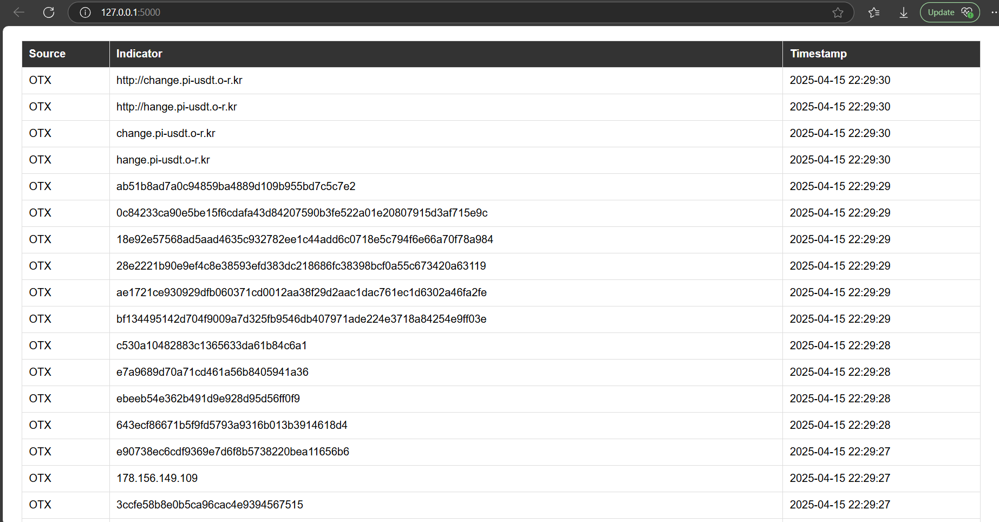
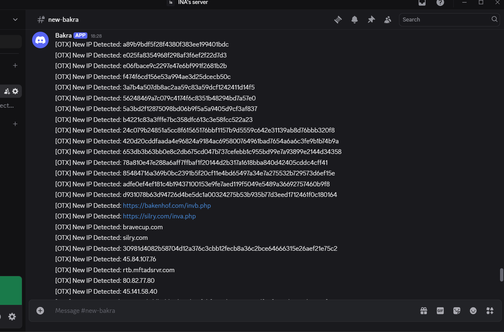

#  ThreatFeed Aggregator

A simple, open-source **Threat Intelligence Aggregator** built for cybersecurity analysts, SOC teams, and researchers. This project fetches threat indicators from **AlienVault OTX**, stores them in a database, displays them on a web dashboard, and sends real-time alerts to a **Discord webhook**.

---

##  Features

-  Collects Indicators of Compromise (IOCs) from OTX
-  Stores data locally in a SQLite database
-  Displays IOCs in a live Flask web dashboard
-  Sends real-time IOC alerts to a Discord channel
-  Easy to extend with more feeds like AbuseIPDB

---

##  Screenshots

###  Web Dashboard  
View recent indicators of compromise from OTX in a live dashboard.

---

###  Discord Alerts  
Real-time alerts delivered directly to your security Discord channel.

---

##  Tech Stack

- **Python 3**
- **Flask**
- **SQLite**
- **OTX API**
- **Discord Webhook**
- **python-dotenv**

---

##  Project Structure

ThreatFeed-Aggregator/
├── app/
│   ├── __init__.py              # Package initializer
│   ├── collector.py             # Fetches OTX threat indicators
│   ├── db.py                    # SQLite database operations
│   ├── notifier.py              # Sends alerts to Discord
│   └── routes.py                # Flask routes for dashboard
│
├── templates/
│   └── dashboard.html           # Web UI HTML template
│
├── static/
│   └── style.css                # Optional styling (CSS)
│
├── .env                         # Environment variables (API keys)
├── run.py                       # Main entry point of the Flask app
├── requirements.txt             # List of Python dependencies
└── README.md                    # Project documentation
├── screenshots/
│   ├── dashboard.png           # Screenshot of your Flask dashboard
│   └── discord_alerts.png      # Screenshot of Discord alerts

---

##  Getting Started

### 1. Clone the repo

git clone https://github.com/ShivamAdke/ThreatFeed-Aggregator.git
cd ThreatFeed-Aggregator

---

### 2. Set up a virtual environment

python -m venv venv
venv\Scripts\activate  # Windows

---

# OR
source venv/bin/activate  # macOS/Linux

---

### 3. Install dependencies
bash
Copy
Edit
pip install -r requirements.txt

---

### 4. Run the application
bash
Copy
Edit
python run.py

Then open your browser at:
📍 http://127.0.0.1:5000/

---

### APIs Used
AlienVault OTX
Used to pull subscribed pulse indicators

OTX API Documentation

---

### Discord Webhook
Used to send real-time alerts to a Discord channel

---

### Future Ideas (Coming Soon)
 Add AbuseIPDB IP feed

 Export IOCs as CSV

 IOC filtering by date, type

 Add basic IOC validation (IP vs URL)

 Add cronjob/scheduler for periodic updates

---

### Contributing
Contributions, pull requests, and stars  are always welcome!

If you'd like to:

Add new threat feed integrations

Improve the dashboard UI

Add filtering, exporting, or enrichments

Feel free to open an issue or a pull request.

---

### License
This project is licensed under the MIT License.
You are free to use, modify, and distribute it.

---

### Author
Shivam Adke
 Cybersecurity Analyst | Threat Hunter | Python Security Tools
 GitHub: @shivamadke
